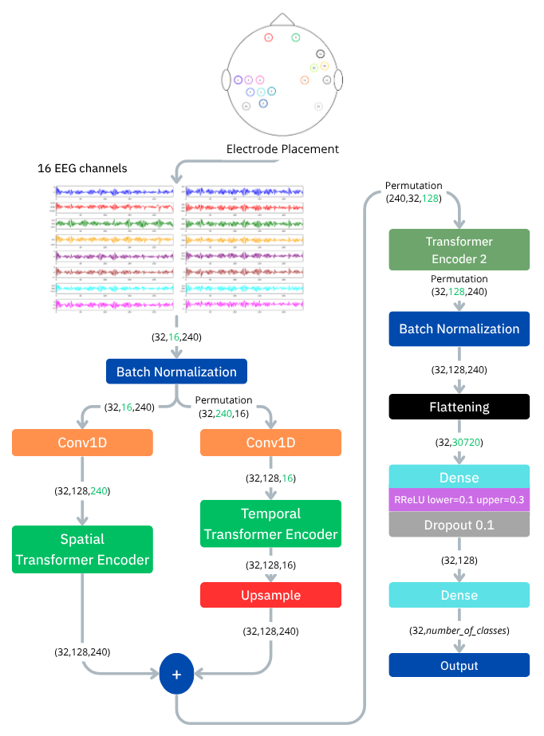

# Imagined-Speech-in-Spanish
This is a repository for the code used in "Imagined Speech in Spanish: EEG Dataset Acquisition Protocol and Baseline Classification Results."

## Source
This paper is currently under review 

## Description of the repository
This repository contains the code for the classifier implemented in the paper 

## Block diagram of our proposal 

