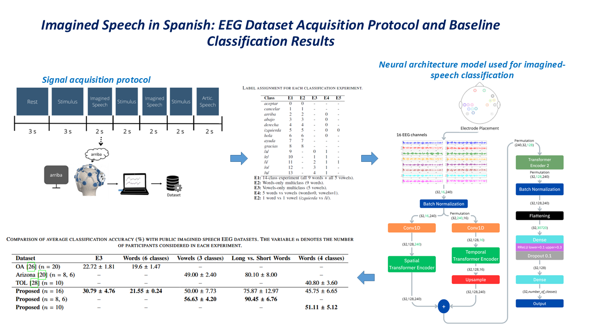

# Imagined-Speech-in-Spanish
This is a repository for the code used in "Imagined Speech in Spanish: EEG Dataset Acquisition Protocol and Baseline Classification Results."

## Source
This paper is currently under review 

## Description of the repository
transformer-hi.py implements the transformer-based neural architecture used for the baseline classification experiments reported in the paper.

This program contains the model configuration, training pipeline, and evaluation procedures used to analyze EEG signals recorded during imagined speech tasks. The architecture is specifically adapted to the characteristics of the acquired data, including 16-channel EEG recordings obtained with low-cost hardware.

The associated imagined-speech EEG dataset will be made publicly available upon acceptance of the manuscript for publication.

## Graphical Abstract

## Citation
If you use this code, please cite:

[Paper citation will be added upon acceptance]

## Status
Dataset release pending journal acceptance.
