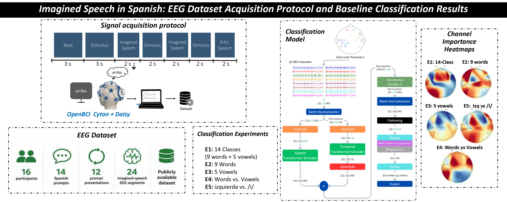

# Imagined-Speech-in-Spanish
This repository contains the code and resources associated with the paper "Imagined Speech in Spanish: EEG Dataset Acquisition Protocol and Baseline Classification Results."

## Dataset 
The dataset was developed with the participation of the following team members:

Student Participants:

**MI. Luis Raúl Sigala González**, UACH Faculty of Engineering.
**Alan Hernández Galván**, UACH Faculty of Medicine and Biomedical Sciences.

Principal Investigators:

**Dr. Graciela María de Jesús Ramírez Alonso**, UACH Faculty of Engineering.  
**Dr. Javier Camarillo Cisneros**, UACH Faculty of Medicine and Biomedical Sciences.  
**Dr. Abimael Guzmán Pando**, UACH Faculty of Medicine and Biomedical Sciences.  
**Dr. Juan Alberto Ramírez Quintana**, Instituto Tecnológico de Chihuahua, Tecnológico Nacional de México.  
**Dr. David Ricardo López Flores**, Instituto Tecnológico de Chihuahua, Tecnológico Nacional de México.  

Please complete the following form to request access to the EEG dataset.

The information collected will be used only to evaluate the request and keep a record of dataset use for academic and research purposes. 
https://docs.google.com/forms/d/e/1FAIpQLSecO2j5EIbDxt-x4ZiMzjlltxislXRgFiHGTrfkpTgH6ZPNGQ/viewform?usp=header 

## Graphical Abstract

## Codes
The Codes folder contains the Python programs used for:

**EEG signal acquisition
**Signal preprocessing and segmentation
**Implementation of the baseline transformer-based classification model
**Ablation study experiments

## Citation
If you use this code, please cite:

[Paper citation will be added upon acceptance]

## License

This repository is intended for academic and research purposes only.

