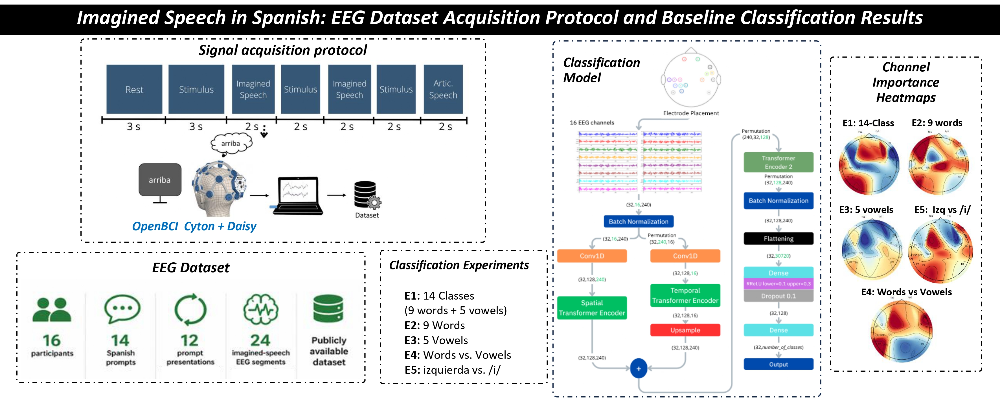

# Imagined Speech in Spanish: EEG Dataset Acquisition Protocol and Baseline Classification Results.

**Manuscript ID:** IEEE LATAM Submission ID: 10609  
**Authors:**
Luis-Raul Sigala-Gonzaleza, Graciela Ramirez-Alonsoa, Juan A. Ramirez-Quintanab, Fernando Martinez-Reyesa, David R. Lopez-Floresb  

a Universidad Autónoma de Chihuahua, Facultad de Ingeniería, Chihuahua, México  
b Tecnológico Nacional de México/Instituto Tecnológico de Chihuahua, Chihuahua, México

Please complete the following form to request access to the EEG dataset.

The information collected will be used only to evaluate the request and keep a record of dataset use for academic and research purposes. 
https://docs.google.com/forms/d/e/1FAIpQLSecO2j5EIbDxt-x4ZiMzjlltxislXRgFiHGTrfkpTgH6ZPNGQ/viewform?usp=header 

## Graphical Abstract

## Codes

This repository contains the complete pipeline used for EEG acquisition, preprocessing, segmentation, baseline classification, ablation experiments, and statistical analysis presented in the manuscript.

| File / Folder | Purpose | Description |
|---|---|---|
| `Audios/` | Experimental stimuli | Contains the audio stimuli used by the graphical user interface (GUI) during the EEG acquisition protocol. |
| `experimentoV2.py` | EEG acquisition | Controls the EEG acquisition process, communicates with the OpenBCI hardware, manages the experimental protocol, and saves the raw EEG recordings. |
| `PantallaInicial.ui` | GUI | Qt Designer file defining the initial interface of the EEG acquisition application. |
| `PantallaSujeto.ui` | GUI | Qt Designer file defining the interface presented to participants during the experimental protocol. |
| `Processing_and_Segmentation.py` | Preprocessing and segmentation | Performs EEG filtering, preprocessing, segmentation, and data organization for the subsequent classification tasks. |
| `transformer_hi.py` | Baseline classification | Performs training, validation, and testing of the Transformer-based baseline classification model using the processed EEG dataset. |
| `Ablationstudy.py` | Ablation study | Performs channel ablation experiments to evaluate the contribution of EEG channels to classification performance. |
| `signal_quality_review.py` | Signal quality analysis | Evaluates characteristics of the processed EEG signals and their relationship with classification performance. |
| `EEG_Wilcoxon.ipynb` | Statistical analysis | Performs statistical comparisons using the Wilcoxon signed-rank test. |
| `SPEARMAN_EEG.ipynb` | Statistical analysis | Performs Spearman correlation analysis between EEG signal characteristics and classification results. |

### General Workflow

The recommended execution order is:

1. Run `experimentoV2.py` to acquire the EEG signals and save the raw recordings.
2. Run `Processing_and_Segmentation.py` to preprocess, filter, segment, and organize the recorded EEG signals.
3. Run `transformer_hi.py` to train, validate, and test the Transformer-based baseline classification model.
4. Run `Ablationstudy.py` and `signal_quality_review.py` for channel ablation and signal quality analyses.
5. Use `EEG_Wilcoxon.ipynb` and `SPEARMAN_EEG.ipynb` for the statistical analyses reported in the manuscript.

> **Note:** The required dataset files must be located in the same directory as the corresponding script before execution.

### Transformer-Based Baseline

The Transformer implementation used as the baseline classifier is based on the following work:

> I. Gallo and S. Corchs, "Thinking is Like Processing a Sequence of Spatial and Temporal Words," in *2024 International Joint Conference on Neural Networks (IJCNN)*, IEEE, 2024.
## Citation
If you use this code, please cite:

Sigala-Gonzalez, L.R., Ramirez-Alonso, G., Ramirez-Quintana, J.A., Martinez-Reyes, F., Lopez-Flores, D.R. (2026). 
Imagined Speech in Spanish: EEG Dataset Acquisition Protocol and Baseline Classification Results.  IEEE Latin America Transactions, ID: 10609.
## License

This repository is intended for academic and research purposes only.

## Dataset 
The dataset was developed with the participation of the following team members:

Student Participants:

**MI. Luis Raúl Sigala González**, UACH Faculty of Engineering.
**Alan Hernández Galván**, UACH Faculty of Medicine and Biomedical Sciences.

Principal Investigators:

**Dr. Graciela María de Jesús Ramírez Alonso**, UACH Faculty of Engineering.  
**Dr. Javier Camarillo Cisneros**, UACH Faculty of Medicine and Biomedical Sciences.  
**Dr. Abimael Guzmán Pando**, UACH Faculty of Medicine and Biomedical Sciences.  
**Dr. Juan Alberto Ramírez Quintana**, Instituto Tecnológico de Chihuahua, Tecnológico Nacional de México.  
**Dr. David Ricardo López Flores**, Instituto Tecnológico de Chihuahua, Tecnológico Nacional de México.  
